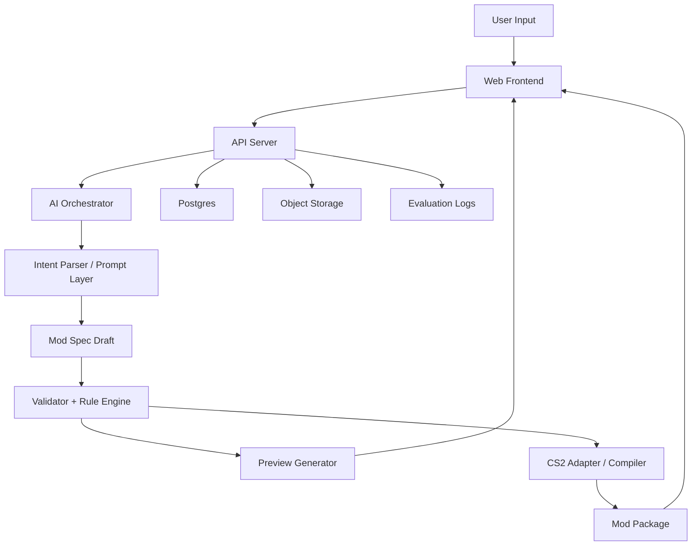

# AI 游戏 Mod 生成产品 MVP 方案与技术架构

## 1. 项目定义

### 1.1 产品目标

构建一个面向普通玩家和轻度创作者的 AI 应用，让用户用自然语言描述想法，系统自动完成：

1. 理解需求
2. 生成可执行的 Mod 设计方案
3. 将设计方案转换为目标游戏可接受的 Mod 结构
4. 输出风险提示、预览和可回退版本

第一阶段只聚焦 `Cities: Skylines II` 的一类窄场景，验证用户价值与技术可行性；验证成功后，再扩展为多游戏通用平台。

### 1.2 核心判断

MVP 不做“万能 Mod 生成器”，只做“可控的参数型 / 平衡型 Mod 设计与生成”。

原因：

1. 需求最清晰，最容易结构化
2. 生成结果可验证，不依赖大量美术资产
3. 错误半径较小，便于回退
4. 更容易建立用户信任

### 1.3 MVP 核心价值

对用户提供三件明确价值：

1. 把模糊创意翻译成清晰的 Mod 设计稿
2. 自动生成一个可执行的、范围可控的 Mod 包
3. 在生成前告诉用户会改什么、风险是什么、如何回退

## 2. 用户与场景

### 2.1 目标用户

优先服务两类人：

1. 有创意但不会写 Mod 的玩家
2. 会折腾游戏参数，但希望提高效率的轻度 Mod 作者

### 2.2 MVP 典型需求

仅覆盖以下需求类型：

1. 调整经济和平衡参数
2. 调整成长速度、资源效率、成本曲线
3. 调整交通或城市发展相关的数值规则
4. 在“增强体验”和“不要破坏平衡”之间做折中

示例：

- “我想让低密度住宅升级更快，但不要让人口爆炸。”
- “我想让公交系统更有吸引力，但不要让财政过于轻松。”
- “我想做一个更适合新手的城市发展节奏 mod。”

### 2.3 MVP 不做的事情

第一版明确不做：

1. 复杂脚本逻辑 Mod
2. 新建筑、新模型、新 UI、大量自定义资源
3. 多 Mod 自动兼容所有第三方生态
4. 自动修改未知格式或未纳入白名单的游戏文件
5. 端到端无人审查发布到社区平台

## 3. MVP 范围

### 3.1 最小可交付能力

MVP 应该至少交付以下能力：

1. 对话式需求输入
2. AI 生成结构化 `Mod Spec`
3. 基于白名单能力的规则校验
4. 参数变更预览
5. 风险提示与冲突提示
6. 生成可导出的 Mod 包或中间产物
7. 保存版本，支持回退到上一个方案

### 3.2 用户流程

1. 用户输入自然语言需求
2. 系统追问缺失约束，例如平衡性、激进程度、是否兼容旧存档
3. LLM 生成 `Mod Spec Draft`
4. 规则引擎做标准化、约束补全和安全校验
5. 前端展示“将修改哪些规则”的预览
6. 用户确认后生成目标游戏的 Mod 产物
7. 系统保存本次版本、说明和回退入口

### 3.3 成功标准

MVP 的成功不看模型是否“聪明”，看三项指标：

1. 用户能否在 5 分钟内完成第一次可用 Mod 生成
2. 生成结果是否可解释、可修改、可回退
3. 同类需求的重复生成是否稳定

建议定义如下验证指标：

- 需求转 `Mod Spec` 成功率 >= 85%
- 校验通过后可成功打包率 >= 90%
- 用户首次生成可接受结果的比例 >= 60%
- 用户对“生成前预览”功能的确认率 >= 70%

## 4. 产品形态

### 4.1 MVP 形态

优先做一个 Web 应用，不先做桌面端。

原因：

1. 迭代快
2. 便于收集日志和评估数据
3. 模型、规则、适配器可以快速更新
4. 可以先导出结果，后续再补安装助手

### 4.2 前端页面

MVP 只需要 4 个核心界面：

1. 需求输入页
2. 方案预览页
3. 版本管理页
4. 游戏适配说明页

### 4.3 输出物

每次生成需要产出 4 类内容：

1. 自然语言设计说明
2. 结构化 `Mod Spec`
3. 校验报告
4. 可导出的 Mod 包或可供手动落地的文件集合

## 5. 技术路线总原则

### 5.1 AI 负责理解与解释，不直接负责最终落地

LLM 的职责：

1. 理解自然语言需求
2. 抽取意图、约束、优先级
3. 生成结构化草案
4. 解释方案、生成风险提示和用户可读说明

确定性程序的职责：

1. 参数映射
2. 白名单校验
3. 依赖检查
4. 冲突检查
5. 生成目标游戏文件
6. 打包与版本管理

这条边界很关键：不能让模型直接随意产出目标游戏文件，否则稳定性和可维护性都会很差。

### 5.2 先做通用中间层，再做多游戏

核心资产不是 prompt，而是这三层：

1. `Mod Spec` 通用结构
2. 每个游戏的能力注册表
3. 每个游戏的编译器 / 适配器

后续扩展到其他游戏时，复用：

- 需求理解层
- 方案解释层
- 校验框架
- 版本管理

只替换游戏适配层。

## 6. 核心架构

### 6.1 系统模块

系统分为 7 个核心模块：

1. Web Frontend
2. API Gateway / App Server
3. AI Orchestrator
4. `Mod Spec` Engine
5. Game Adapter for CS2
6. Packaging and Versioning
7. Data and Evaluation Layer

### 6.2 架构图



## 7. 核心数据模型

### 7.1 `Mod Spec` 设计目标

`Mod Spec` 是系统最重要的数据结构。它必须同时满足：

1. 人能读
2. 机器能校验
3. 游戏适配器能编译
4. 后续能跨游戏复用

### 7.2 推荐结构

```json
{
  "spec_version": "0.1",
  "game": "cities_skylines_2",
  "mod_type": "balance",
  "title": "Faster Low Density Growth",
  "intent": {
    "user_goal": "让低密度住宅升级更快，但保持经济平衡",
    "priority": "balanced",
    "constraints": [
      "avoid_economic_break",
      "prefer_save_compatibility"
    ]
  },
  "changes": [
    {
      "id": "residential.low_density.level_up_speed",
      "operation": "multiply",
      "value": 1.2,
      "bounds": {
        "min": 0.8,
        "max": 1.5
      },
      "reason": "加快前期成长节奏，但避免过强"
    }
  ],
  "compatibility": {
    "save_safe": true,
    "requires_new_game": false
  },
  "risk_flags": [
    "may_increase_population_growth"
  ]
}
```

### 7.3 数据实体

MVP 至少需要以下实体：

1. `User`
2. `Project`
3. `RequirementSession`
4. `ModSpecVersion`
5. `ValidationReport`
6. `BuildArtifact`
7. `GameCapabilityRegistry`

## 8. 模块设计

### 8.1 Web Frontend

推荐技术栈：

- `Next.js`
- `TypeScript`
- `Tailwind CSS`
- `React Query` 或等价数据层

前端职责：

1. 采集用户需求
2. 展示追问与补充约束
3. 展示参数变更预览
4. 展示风险、冲突、可回退版本
5. 下载导出物

### 8.2 API Server

推荐技术栈：

- `FastAPI`
- `Pydantic`
- `PostgreSQL`

后端职责：

1. 管理会话、项目、版本
2. 调用模型并编排工作流
3. 调用校验器和游戏适配器
4. 保存生成产物和日志

选择 Python 的原因：

1. 更适合 AI 编排和结构化输出处理
2. 校验器、规则引擎和适配器写起来更快
3. 后续接入自动评测更方便

### 8.3 AI Orchestrator

这是连接模型与业务规则的控制层，职责包括：

1. 需求解析
2. 缺失字段追问
3. 结构化输出约束
4. 多轮修订
5. 用户可读解释生成

推荐做法：

1. 使用严格 JSON Schema 输出
2. 对 `Mod Spec Draft` 做二次校验，不能直接入库
3. 把模型输出当成“候选方案”，不是事实来源

### 8.4 Rule Engine

规则引擎不依赖 LLM，使用确定性代码实现。

职责：

1. 字段合法性校验
2. 参数范围钳制
3. 依赖关系检查
4. 冲突检查
5. 自动补充默认约束
6. 风险标记

示例规则：

1. 某些参数只能在预设范围内调整
2. 某些组合修改会显著破坏平衡，应给出警告
3. 某些改动不兼容旧存档，应显式标记

### 8.5 CS2 Game Adapter

这是 MVP 最关键的游戏专属模块。

职责：

1. 定义 CS2 可支持的白名单能力
2. 维护参数 ID 到目标文件 / 规则节点的映射
3. 将通用 `Mod Spec` 编译成 CS2 可接受的产物
4. 输出构建日志和错误原因

建议将其拆成 3 个子模块：

1. `capability_registry`
2. `spec_compiler`
3. `package_builder`

### 8.6 Packaging and Versioning

MVP 需要最基础的版本管理：

1. 每次生成都保存一个 `Mod Spec` 版本
2. 每次构建都保存产物和日志
3. 允许回退到任一历史版本重新导出

不需要一开始就做复杂协作，但必须可追踪：

1. 用户最初需求是什么
2. LLM 生成了什么草案
3. 规则引擎修正了什么
4. 最终导出了什么

### 8.7 Evaluation Layer

MVP 就要埋评估体系，否则后面很难迭代。

至少记录：

1. 用户原始需求
2. 模型输出的草案
3. 校验失败原因
4. 用户修改点
5. 用户最终是否接受方案
6. 构建是否成功

后续这些数据会变成：

1. Prompt 调优样本
2. 规则缺口发现来源
3. 多游戏泛化的训练数据

## 9. 能力注册表设计

### 9.1 为什么需要注册表

MVP 的安全边界来自“白名单能力注册表”，而不是来自 prompt。

模型只能在注册表允许的能力范围内生成改动。

### 9.2 注册表建议结构

```json
{
  "game": "cities_skylines_2",
  "capabilities": [
    {
      "id": "residential.low_density.level_up_speed",
      "label": "Low Density Level Up Speed",
      "type": "float",
      "allowed_operations": ["set", "add", "multiply"],
      "safe_range": {
        "min": 0.8,
        "max": 1.5
      },
      "tags": ["housing", "growth", "balance"],
      "save_compatibility": "likely_safe"
    }
  ]
}
```

### 9.3 注册表来源

第一版不要追求全量，只做几十个高价值参数。

优先顺序：

1. 住宅成长
2. 财政与成本
3. 公交吸引力
4. 服务效率
5. 资源与生产节奏

## 10. API 设计建议

MVP 只需要少量接口：

1. `POST /projects`
2. `POST /requirements/parse`
3. `POST /specs/generate`
4. `POST /specs/{id}/validate`
5. `POST /specs/{id}/build`
6. `GET /projects/{id}/versions`
7. `GET /builds/{id}/download`

接口原则：

1. 所有模型输出都先落成结构化草案
2. 所有构建都必须依赖已通过校验的版本
3. 所有构建结果都可以追溯到具体 `Mod Spec`

## 11. 实施计划

### 11.1 第 0 阶段：产品与数据定义

目标：锁定边界，不急着写太多 UI。

交付物：

1. `Mod Spec v0.1`
2. `CS2 capability registry v0.1`
3. 20 到 30 条真实用户需求样本
4. 校验规则清单

### 11.2 第 1 阶段：设计助手可用

目标：先让“需求 -> 设计稿 -> 预览”跑通。

交付物：

1. 对话输入页
2. 结构化生成
3. 风险提示
4. 方案预览

此阶段即使还不能导出完整 Mod，也已经能验证用户价值。

### 11.3 第 2 阶段：可执行生成

目标：在有限能力白名单下生成可导出的结果。

交付物：

1. CS2 编译器
2. 基础打包流程
3. 构建日志
4. 版本回退

### 11.4 第 3 阶段：评估与泛化准备

目标：验证该模式能否扩展到第二个游戏。

交付物：

1. 通用适配器接口
2. 第二游戏的 capability registry 草案
3. 通用评测样本集

## 12. 团队分工建议

MVP 阶段最小团队可以是 3 人：

1. 产品 / 创始人：负责场景定义、需求样本、能力边界
2. 全栈工程师：负责前后端与版本系统
3. AI / 系统工程师：负责 `Mod Spec`、规则引擎、模型编排、适配器

如果只有 1 到 2 人，也能做，但必须先砍范围，不要做安装器、社区、多人协作。

## 13. 风险与应对

### 13.1 最大风险

1. 游戏适配层复杂度被低估
2. 模型输出不稳定，导致结果不可复现
3. 用户需求过于开放，超出白名单能力
4. 生成结果可解释性不足，用户不敢用

### 13.2 应对策略

1. 严格限制能力范围，只做白名单参数
2. 模型只生成草案，最终结果由规则引擎收口
3. 每次生成都展示“改了什么”和“为什么这样改”
4. 先做设计助手，再做全自动构建

## 14. 长期演进路线

MVP 成功后，平台化方向可以分三步：

1. 多参数类型扩展
2. 多游戏适配扩展
3. 社区化与模板市场扩展

长期的真正平台资产是：

1. 通用 `Mod Spec`
2. 游戏能力注册表体系
3. 游戏适配器 SDK
4. 自动评测与回归测试数据集

## 15. 推荐结论

如果现在就开始落地，建议做下面这个版本，而不是更大的版本：

### MVP 一句话定义

一个面向 `Cities: Skylines II` 的 AI Mod 设计与生成助手，允许用户通过自然语言生成“参数型 / 平衡型” Mod，并在生成前查看结构化改动、风险提示和版本回退信息。

### 第一版必须坚持的边界

1. 只做一个游戏
2. 只做一类 Mod
3. 只开放白名单参数
4. 先做可解释、可校验，再做更强自动化

### 第一版最值得投入的资产

1. `Mod Spec`
2. `capability registry`
3. `rule engine`
4. `CS2 adapter`
5. 评估日志体系

---

如果继续往下推进，下一步最值得产出的不是 UI，而是两份底层文档：

1. `Mod Spec v0.1` 详细字段定义
2. `Cities: Skylines II capability registry v0.1` 初版能力清单

这两份文档会直接决定后面的工程复杂度和可扩展性。
