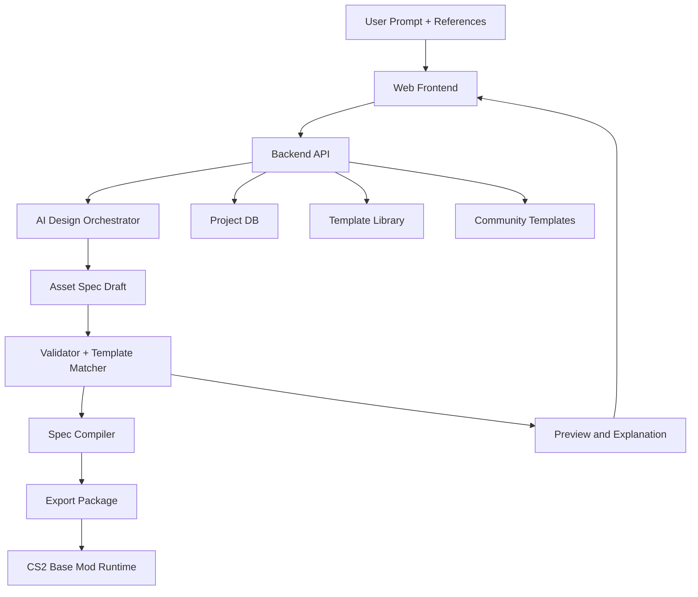

# CS2 方向修订：从参数型 Mod 转向可放置资产生成

## 1. 修订结论

你指出的两个问题是对的：

1. `Cities: Skylines II` 的实际 Mod 落地路径，很可能不适合假设成“Web 端直接导出简单配置文件即可生效”
2. “平衡参数调整”对普通玩家是低频需求，不足以支撑长期留存

基于这两个判断，产品方向应做两处关键修订：

1. 技术路径从“直接生成目标游戏文件”调整为“`Base Mod + Spec Runtime`”
2. 产品焦点从“平衡参数 Mod”调整为“可放置的交通枢纽 / 地标资产生成助手”

更直接地说：

第一版不应该承诺“AI 直接生成任意完整 CS2 Mod”，而应该承诺“AI 帮用户生成一个可放置、可编辑、可分享的站点 / 机场类资产包”。

## 2. 新的产品定义

### 2.1 一句话定义

一个面向 `Cities: Skylines II` 创作者的 AI 资产生成助手，帮助用户通过自然语言和参考图，生成可放置的火车站、地铁站、机场等交通枢纽资产，并通过一个预装的 `Base Mod` 在游戏中读取、实例化和应用。

### 2.2 核心用户

这次不再优先服务“只想改平衡的普通玩家”，而是优先服务：

1. 想做自定义车站 / 机场 / 地标，但缺少完整建模和 Mod 开发能力的创作者
2. 已经会做一点资产，但希望提高设计和拼装效率的半专业作者
3. 喜欢下载、修改、分享模板的社区用户

### 2.3 价值主张

对用户的明确价值变成：

1. 把“我想做一个什么样的站 / 机场”翻译成结构化设计蓝图
2. 自动生成一个可以放进游戏里的可放置资产包
3. 允许用户基于模板继续微调，而不是从零开始做完整 Mod
4. 允许创作者分享模板、被他人二次创作和复用

## 3. 技术现实修正

### 3.1 对 CS2 的合理假设

MVP 不假设：

1. 所有目标改动都能通过简单 JSON/XML 直接导出并生效
2. 任意游戏逻辑都能在 Web 端编译完成
3. 任意高保真 3D 资产都能由 AI 全自动一次生成成功

MVP 改为假设：

1. 游戏侧需要一个你自己维护的 `Base Mod`
2. `Base Mod` 负责读取外部 `Spec` 文件，并在游戏内进行实例化、数值应用或模块拼装
3. Web 端负责生成 `Spec`、模板组合、元数据和导出包
4. 复杂的底层运行时能力由 `Base Mod` 封装

### 3.2 `Base Mod` 的角色

`Base Mod` 是整个技术方案的关键，不是附件。

它应承担以下职责：

1. 读取 `Asset Spec` / `Layout Spec`
2. 根据 Spec 在游戏中实例化预定义模块
3. 应用可控范围内的数值、材质、主题、标识、连接点配置
4. 提供版本兼容层，屏蔽部分底层实现变化
5. 作为后续社区模板运行时的统一宿主

因此，Web 端的 `Game Adapter` 本质上应该改名为：

- `Spec Compiler`
- `Package Builder`
- `Base Mod Runtime Target`

## 4. 产品方向修订

### 4.1 不建议的目标

如果你的目标是：

- “让 AI 完整生成一个高质量、完全原创、可直接上架的香港机场 3D 资产”

那不适合作为 MVP。原因不是没有价值，而是工程跨度太大，至少同时包含：

1. 3D 网格生成
2. 拓扑清理
3. 材质与 UV
4. LOD
5. 碰撞与连接点
6. 游戏内逻辑绑定
7. 兼容性测试

这已经不是一个 MVP，而是完整资产生产管线。

### 4.2 更可行的 MVP 目标

更现实的第一版应当是：

1. AI 生成“交通枢纽蓝图”
2. 蓝图映射到一套预制模块库
3. `Base Mod` 根据蓝图在游戏内实例化
4. 用户得到一个可放置、可分享、可继续编辑的站点 / 机场资产

换句话说，MVP 的本质不是“从零生成任何资产”，而是“用 AI 驱动模板化、模块化、参数化的资产创作”。

## 5. 具体产品范围

### 5.1 第一优先级：火车站 / 地铁站

最适合先做的是站类资产，而不是机场。

原因：

1. 规模更小
2. 结构更规则
3. 模块化程度更高
4. 可复用模板更多
5. 用户验证成本更低

推荐顺序：

1. 小型火车站
2. 中型换乘站
3. 地铁站
4. 区域机场
5. 大型机场

### 5.2 MVP 可支持的能力

第一版建议支持以下能力：

1. 通过自然语言描述站点类型、风格、规模和功能
2. 上传参考图，提取风格元素
3. 生成站点 / 机场蓝图 Spec
4. 基于模板库生成可放置资产
5. 可配置名称、站台数、入口数量、外立面风格、色彩、标识语言
6. 导出分享包，让其他用户可直接加载

### 5.3 MVP 不做的能力

第一版明确不做：

1. 完全从零生成高精度原创 3D 网格
2. 仅凭几张照片就 1:1 复刻真实建筑
3. 自动处理所有复杂交通逻辑和边缘兼容问题
4. 任意用户模板都自动通过质量审核

## 6. “香港机场 Mod” 应该怎么拆

### 6.1 不现实的版本

“输入一句话，自动生成一个完整可商用品质的香港国际机场资产，并可直接放入游戏。”

这个版本不应该作为第一阶段承诺。

### 6.2 现实的 MVP 版本

“输入你想要的机场风格、规模和功能分区，上传若干参考图，系统生成一个‘香港机场风格灵感’的小型区域机场模板，并通过 `Base Mod` 在游戏内实例化为一个可放置资产。”

这个版本是可落地的，因为它依赖的是：

1. 模块拼装
2. 风格映射
3. 连接点与区域布局
4. 模板参数化

而不是高质量自由建模。

## 7. 新的核心数据结构

### 7.1 从 `Mod Spec` 扩展为 `Asset Spec`

这一版真正的中心对象不再只是数值改动，而是一个可放置资产的结构化定义。

推荐结构：

```json
{
  "spec_version": "0.1",
  "game": "cities_skylines_2",
  "asset_type": "train_station",
  "title": "Modern Harbor Station",
  "style": {
    "theme": "modern_transit",
    "regional_inspiration": "hong_kong",
    "materials": ["glass", "steel", "concrete"]
  },
  "footprint": {
    "width": 64,
    "length": 128,
    "height_class": "midrise"
  },
  "modules": [
    {
      "module_id": "station.platform.island.medium",
      "count": 2
    },
    {
      "module_id": "station.concourse.glass_hall",
      "count": 1
    },
    {
      "module_id": "station.entrance.corner",
      "count": 2
    }
  ],
  "connections": {
    "rail_tracks": 4,
    "road_access": 2,
    "pedestrian_entries": 3
  },
  "decor": {
    "sign_language": ["zh-HK", "en"],
    "color_palette": ["#C8102E", "#E6E6E6", "#333333"]
  },
  "runtime_constraints": {
    "template_only": true,
    "requires_base_mod": true
  }
}
```

### 7.2 这个结构的意义

它让 AI 的职责变得可控：

1. 生成风格与布局意图
2. 选择模板和模块
3. 组合成可执行的蓝图

真正复杂的事情交给 `Base Mod` 和模板库处理。

## 8. 修订后的系统架构

### 8.1 模块划分

系统应分成 8 层：

1. Web Frontend
2. Backend API
3. AI Design Orchestrator
4. `Asset Spec` Engine
5. Template Library
6. `Spec Compiler`
7. `Base Mod Runtime`
8. Community / Sharing Layer

### 8.2 架构图



## 9. 新的 MVP 路线

### 9.1 Phase 0：先做 `Base Mod`

这是必须最先验证的技术前提。

交付目标：

1. 游戏内成功加载一个外部 `Spec`
2. 能用 `Spec` 实例化至少一种站点模板
3. 能读到外部参数并改变模块配置

如果这一步不通，Web 端再漂亮都没有意义。

### 9.2 Phase 1：站点模板生成

目标：

1. 支持小型火车站和地铁站
2. 支持文本输入生成蓝图
3. 支持模板化导出和加载
4. 支持基础分享

这一步就已经足够验证“创作型需求”是否成立。

### 9.3 Phase 2：参考图驱动风格生成

目标：

1. 用户上传参考图
2. AI 抽取风格词、材料、色彩和结构偏好
3. 将其映射到模板库和装饰层

这一步能显著增强“我想做香港风格车站 / 机场”的主观满足感。

### 9.4 Phase 3：机场模板

在站类资产跑通后，再扩展机场。

理由：

1. 机场的模块关系更复杂
2. 尺寸更大
3. 连接点和功能区更多
4. 如果直接从机场开始，MVP 失败概率太高

## 10. 留存与社区修订

### 10.1 你对低频问题的判断是对的

“平衡参数调整”更像一次性工具，而不是有持续活跃度的产品。

要提高留存，产品必须尽快加入“可分享、可 remix、可复用”的层。

### 10.2 社区层的最小实现

MVP 之后应尽快加入：

1. 模板分享页
2. 一键复制 / remix
3. 标签分类，例如 `hong-kong-style`、`modern-station`
4. 收藏和下载统计

### 10.3 真正的增长飞轮

增长飞轮不是“更多用户修改参数”，而是：

1. 创作者做出一个模板
2. 社区用户下载、修改、二次创作
3. 系统积累更多高质量模板
4. AI 推荐和生成越来越准

因此，长期看这更像“AI 驱动的资产创作平台”，而不是“参数 Mod 工具”。

## 11. 商业与定位建议

### 11.1 更合理的产品定位

产品定位建议从：

- “AI 自动生成游戏 Mod”

改成：

- “AI 辅助创建和分享可放置游戏资产”

这个定位更清晰，也更接近用户愿意持续使用的场景。

### 11.2 初期商业化方向

比起面对所有普通玩家，更适合先面向创作者。

初期可以考虑：

1. 高级模板订阅
2. 私有项目与版本管理
3. 社区模板分发抽成
4. 专题资产包，例如港风交通、现代机场、欧洲火车站

## 12. 最终建议

如果按照你刚才提出的真实需求，我会把产品策略改成下面这样：

### 新的一句话 MVP

一个面向 `Cities: Skylines II` 的 AI 资产创作助手，允许用户通过自然语言和参考图生成“可放置的站点 / 机场模板资产”，由你维护的 `Base Mod` 在游戏内读取和实例化。

### 必须坚持的工程边界

1. 先做 `Base Mod`
2. 先做模板化资产，不做自由 3D 生成
3. 先做火车站 / 地铁站，再做机场
4. 先做分享和 remix，再谈平台化扩张

### 你现在最应该投入的三个资产

1. `Base Mod Runtime`
2. `Asset Spec v0.1`
3. `Template Library v0.1`

如果这三个东西做起来，后面的 AI、社区、模板市场才有真正的基础。
